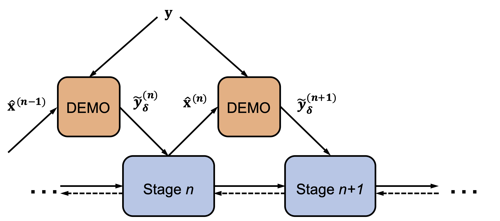

# DEMO

This repository provides codes for the paper: [DEMO: A Flexible Deartifacting Module for Compressed Sensing MRI](https://ieeexplore.ieee.org/document/9732174). 

Here we provide an example to showcase the implementation of the DEMO algorithm, with [ADMM-Net](https://github.com/yangyan92/Deep-ADMM-Net) (Y. Yang et al, NIPS 2016) as the backbone. Data can be downloaded from [this repository](https://github.com/yangyan92/ADMM-CSNet). As a flexible add-on module (architecture shown below), DEMO can be readily extended to other algorithms (e.g. [ADMM-CSNet](https://github.com/yangyan92/ADMM-CSNet), [TVAL3](https://www.caam.rice.edu/~optimization/L1/TVAL3/), [NLR-CS](http://see.xidian.edu.cn/faculty/wsdong/Code_release/NLR_codes.rar)) with some slight modifications. 



# Visualization results

MRI data with synthetic artifacts:


MRI data with real artifacts:


# Citation

Plain text:

> Y. Zhang, X. Mao, J. Wang and W. Liu, "DEMO: A Flexible Deartifacting Module for Compressed Sensing MRI," in *IEEE Journal of Selected Topics in Signal Processing*, doi: 10.1109/JSTSP.2022.3158057.

Bibtex:

```tex
@article{zhang2022demo,
  author={Zhang, Yilang and Mao, Xiaojun and Wang, Jian and Liu, Weidong},
  journal={IEEE Journal of Selected Topics in Signal Processing}, 
  title={DEMO: A Flexible Deartifacting Module for Compressed Sensing MRI}, 
  year={2022},
  volume={16},
  number={4},
  pages={725-736},
  doi={10.1109/JSTSP.2022.3158057}
}
```
